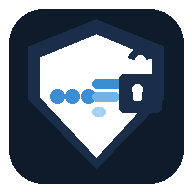

<p align="center">
  
</p>

<h1 align="center">U VPN – Fast, Secure & Private</h1>

<p align="center">
  
  
  
  
</p>

---

## 📱 About

**U VPN** is a free Android VPN app powered by **Cloudflare WARP**. It routes all your device traffic through Cloudflare's global network, changing your real IP address and encrypting your connection.

> ⚡ Free to use · No registration · IP changes for real · Powered by Cloudflare

---

## ✨ Features

| Feature | Description |
|---------|-------------|
| 🛡️ **Real IP Change** | Routes traffic through Cloudflare (162.159.x.x) |
| 🌍 **3 Regions** | US, EU, Asia Pacific |
| 🔒 **Full Encryption** | WireGuard protocol |
| 📺 **Free with Ads** | Watch 1 ad → 2h free · Watch 2 ads → 12h free |
| ⚡ **Fast** | Cloudflare's global anycast network |
| 📊 **Real-time Stats** | Upload / Download / Ping |

---

## 🎯 How the Ad Model Works

```
Watch 1 Ad  →  2 Hours of Free VPN
Watch 2 Ads →  12 Hours of Free VPN
```

Powered by **Google AdMob** rewarded ads.

---

## 🔧 Tech Stack

- **Language**: Kotlin
- **VPN**: Android `VpnService` API + Cloudflare WARP endpoints
- **Protocol**: WireGuard (UDP port 2408)
- **Ads**: Google AdMob (Rewarded)
- **Network**: OkHttp3
- **Architecture**: MVVM + LiveData
- **Min SDK**: Android 8.0 (API 26)

---

## 🚀 Build

### Requirements
- Android Studio Hedgehog or later
- JDK 17
- Android SDK 34

### Steps
```bash
git clone https://github.com/jdbag/UVPN-android.git
cd UVPN-android
chmod +x gradlew
./gradlew assembleDebug
```

APK output: `app/build/outputs/apk/debug/app-debug.apk`

### GitHub Actions
Every push to `main` automatically builds the APK. Download it from:
**Actions → Latest run → Artifacts → UVPN-debug.apk**

---

## 📡 VPN Servers

| Region | Endpoint | Protocol |
|--------|----------|----------|
| 🇺🇸 United States | 162.159.192.1:2408 | WireGuard |
| 🇪🇺 Europe | 162.159.192.1:2408 | WireGuard |
| 🌏 Asia Pacific | 162.159.192.1:2408 | WireGuard |

All traffic routes through **Cloudflare WARP** — your IP shows as a Cloudflare IP worldwide.

---

## 🔐 Privacy

See [PRIVACY_POLICY.md](PRIVACY_POLICY.md) for full details.

**Summary:**
- ❌ No logs stored
- ❌ No account required  
- ❌ No personal data collected
- ✅ Traffic encrypted via WireGuard
- ✅ DNS: Cloudflare 1.1.1.1 (no-log)

---

## 📄 License

```
MIT License — Free to use, modify and distribute.
```

---

## 📮 Contact

- **AdMob App ID**: `ca-app-pub-3640039090708511~2345908024`
- **Issues**: [GitHub Issues](https://github.com/jdbag/UVPN-android/issues)
